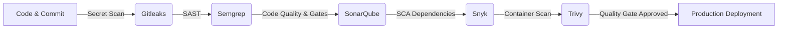

# DevSecOps no Desenvolvimento Seguro (CI/CD) com GitHub Actions

Este repositório é uma solução completa e de referência prática para a implementação do **Ciclo de Vida Seguro de Software (SSDLC - Secure Software Development Life Cycle)** através de automação **DevSecOps** no **GitHub Actions**.

---

## 🛡️ Visão Geral & Filosofia "Shift-Left"

O conceito de **DevSecOps** consiste na integração da segurança em todas as fases do ciclo de desenvolvimento, em vez de tratá-la como um controlo final isolado. A abordagem **"Shift-Left"** move os testes de segurança para o início da pipeline (no commit e na Pull Request), permitindo identificar e corrigir falhas de segurança mais cedo, com um custo drasticamente inferior.



---

## 🛠️ Tecnologias Utilizadas e o seu Papel no SSDLC

### 1. Deteção Ativa de Credenciais Expostas (Secret Scanning)
* **Tecnologia:** [Gitleaks](https://github.com/gitleaks/gitleaks)
* **Fase no SSDLC:** Pre-commit & Integração Inicial (Commit / PR)
* **Objetivo:** Impedir que palavras-passe, chaves de API (AWS, Azure, Stripe), tokens JWT e certificados sejam expostos no histórico do Git.
* **Ficheiro de Configuração:** `.gitleaks.toml`

### 2. Análise Estática de Código - SAST Leve
* **Tecnologia:** [Semgrep](https://semgrep.dev/)
* **Fase no SSDLC:** Análise de Código Fonte (Static Code Analysis)
* **Objetivo:** Analisar a sintaxe e semântica do código em busca de antipadrões de segurança (OWASP Top 10), injeção SQL, XSS, uso perigoso de `eval()`, sem necessidade de compilação.
* **Ficheiro de Configuração:** `.semgrep.yml` e integração SARIF com o GitHub Security.

### 3. Análise Estática & Quality Gates
* **Tecnologia:** [SonarQube](https://www.sonarsource.com/products/sonarqube/)
* **Fase no SSDLC:** Validação de Qualidade e Segurança de Código
* **Objetivo:** Identificar vulnerabilidades complexas, Security Hotspots, Code Smells e duplicações. Define o **Quality Gate**: se a nota de segurança não for "A", a pipeline é bloqueada.
* **Ficheiro de Configuração:** `sonar-project.properties`

### 4. Análise de Vulnerabilidades em Dependências (SCA)
* **Tecnologia:** [Snyk Open Source](https://snyk.io/)
* **Fase no SSDLC:** Análise de Composição de Software (Software Composition Analysis)
* **Objetivo:** Verificar todas as bibliotecas e pacotes de terceiros no `package.json` contra uma base de dados de vulnerabilidades conhecidas (CVEs).
* **Execução:** CLI automatizado com geração de relatório SARIF.

### 5. Varrimento e Hardening de Imagens de Containers
* **Tecnologia:** [Trivy (Aqua Security)](https://trivy.dev/)
* **Fase no SSDLC:** Empacotamento & Infraestrutura (Container Security)
* **Objetivo:**
  - Varrimento de vulnerabilidades do sistema operativo no container Docker (ex: `node:20-alpine`).
  - Validação de Hardening no `Dockerfile` (ex: execução como utilizador não-root `USER node`).
* **Ficheiros:** `Dockerfile` e `.dockerignore`

---

## 📁 Estrutura do Repositório

```
ci-cd-sec/
├── .github/
│   └── workflows/
│       └── devsecops-pipeline.yml   # Workflow completo no GitHub Actions
├── src/
│   └── server.js                    # Microserviço backend Node.js (API REST segura)
├── scripts/
│   └── run-local-security-audit.ps1 # Script de testes e auditoria local (PowerShell)
├── .gitleaks.toml                   # Regras de deteção de segredos
├── .semgrep.yml                     # Regras SAST personalizadas
├── sonar-project.properties         # Configuração do SonarQube Scanner
├── Dockerfile                       # Container seguro (Multi-stage + Non-root)
├── .dockerignore                    # Ficheiros ignorados pelo build Docker
├── package.json                     # Manifesto do projeto e dependências
├── index.html                       # Dashboard Visual Interativo DevSecOps
├── styles.css                       # Estilos Glassmorphism Dark Theme
├── app.js                           # Motor de simulação do Dashboard
└── README.md                        # Guia e documentação técnica do projeto
```

---

## 🚀 Como Executar o Projeto

### 1. Executar a Aplicação e o Dashboard Interativo
Pode arrancar a aplicação Node.js e aceder ao Dashboard no navegador:

```bash
# Instalar dependências
npm install

# Iniciar o servidor
npm start
```
Aceda a `http://localhost:3000` no seu navegador para ver o **Dashboard Interativo DevSecOps** com a simulação completa do pipeline.

---

### 2. Executar Auditoria Local de Segurança (PowerShell)
Para simular as verificações do pipeline no seu ambiente de desenvolvimento local sem depender do GitHub:

```powershell
# Executar o script de auditoria de segurança
.\scripts\run-local-security-audit.ps1
```

---

## ⚙️ Configuração dos GitHub Secrets no GitHub Actions

Para ativar todos os estágios do pipeline `.github/workflows/devsecops-pipeline.yml` num repositório GitHub real, adicione os seguintes segredos em **Settings > Secrets and variables > Actions**:

| Nome do Secret | Descrição | Origem |
| :--- | :--- | :--- |
| `SONAR_TOKEN` | Token de autenticação do SonarQube / SonarCloud | Painel do SonarQube |
| `SONAR_HOST_URL` | URL da instância do SonarQube (ex: `https://sonarcloud.io`) | Servidor SonarQube |
| `SNYK_TOKEN` | Token API de conta Snyk | Painel de definições de conta no Snyk.io |
| `GITHUB_TOKEN` | Gerado automaticamente pelo GitHub Actions | Nativo do GitHub |

---

## 📊 Definição de Security Quality Gates

No fluxo de desenvolvimento seguro (SSDLC), um **Quality Gate** atua como uma barreira automática que impede a promoção do código se um critério de segurança for violado:

1. **Gate 1 (Gitleaks):** 0 Segredos ou credenciais expostas.
2. **Gate 2 (Semgrep):** 0 Vulnerabilidades de severidade `ERROR` (OWASP Top 10).
3. **Gate 3 (SonarQube):** Rating de Segurança **A**, 0 Vulnerabilidades Críticas.
4. **Gate 4 (Snyk):** 0 Vulnerabilidades em dependências com severidade `HIGH` ou `CRITICAL`.
5. **Gate 5 (Trivy):** 0 Vulnerabilidades críticas na Imagem Docker e cumprimento do Hardening do `Dockerfile`.

Se qualquer um dos portões falhar, o job final `build-and-verify` não é executado e o deployment é abortado.
