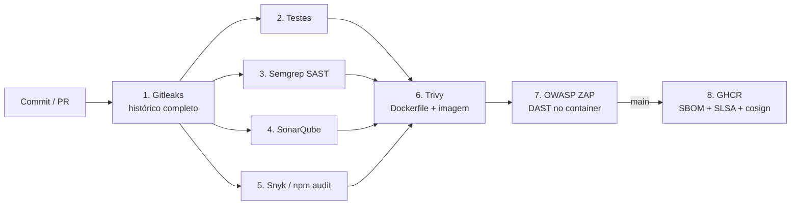

# SecOps: Pipeline DevSecOps (SSDLC) com GitHub Actions

[](https://github.com/RicardoP24/SecOps/actions/workflows/devsecops-pipeline.yml)

Implementação prática do **Ciclo de Vida de Desenvolvimento de Software Seguro (SSDLC)** numa aplicação Node.js/Express:
cada commit passa por **gates de segurança que bloqueiam de facto** o pipeline, e só o código aprovado em todos é publicado
como imagem de container **assinada**.

- 📘 [Explicação detalhada do pipeline](docs/PIPELINE_EXPLANATION.md)
- 🎭 [Laboratório multi-utilizador: Alice (código seguro) vs Bob (credencial exposta + `eval()`)](docs/LAB_MULTIUSER_WORKFLOW.md)
- 🛠️ [Troubleshooting: problemas reais encontrados e como foram resolvidos](docs/TROUBLESHOOTING.md)

## Pipeline


```mermaid
flowchart LR
    A[Commit / PR] --> B[1. Gitleaks<br/>histórico completo]
    B --> C[2. Testes]
    B --> D[3. Semgrep SAST]
    B --> E[4. SonarQube]
    B --> F[5. Snyk / npm audit]
    C & D & E & F --> G[6. Trivy<br/>Dockerfile + imagem]
    G --> H[7. OWASP ZAP<br/>DAST no container]
    H -->|main| I[8. GHCR<br/>SBOM + SLSA + cosign]
```

| Gate | Ferramenta | Bloqueia quando |
|---|---|---|
| Segredos | **Gitleaks** (regras por omissão + regras do projeto, todo o histórico git) | qualquer segredo |
| Testes | **node:test** (API, cabeçalhos de segurança, CORS, rate limiting, ficheiros não expostos) | teste falhado |
| SAST | **Semgrep** (JavaScript, Node.js, OWASP Top 10, Dockerfile, GitHub Actions + regras próprias) | achado `ERROR`/`WARNING` |
| SAST + qualidade | **SonarQube** Quality Gate (quando `SONAR_TOKEN` está configurado) | Quality Gate falhado |
| SCA | **Snyk** (com `SNYK_TOKEN`) ou **npm audit** | dependência HIGH/CRITICAL |
| Container | **Trivy**: configuração do Dockerfile e CVEs da imagem | HIGH/CRITICAL (CVEs com correção disponível) |
| DAST | **OWASP ZAP** baseline contra o container em execução (`--read-only`) | regras `FAIL` em [`.zap/rules.tsv`](.zap/rules.tsv) |
| Supply chain | **GHCR** + SBOM + proveniência SLSA + **cosign keyless** (só `main`) | falha de assinatura/verificação |

Os resultados SARIF de Gitleaks, Semgrep, Snyk e Trivy aparecem em **Security → Code scanning**.

### Segurança do próprio pipeline

- Todas as actions fixadas por **SHA de commit** (as tags são mutáveis).
- Permissões mínimas: `contents: read` por omissão; permissões extra só no job que precisa delas.
- Ferramentas com versão fixa (Gitleaks com verificação SHA-256, imagem Semgrep por digest).
- `persist-credentials: false` no checkout; `concurrency` cancela execuções obsoletas.

## Aplicação

API Express com um dashboard estático (`public/`) que simula o trabalho de uma equipa sob SSDLC.

| Controlo | Implementação |
|---|---|
| Cabeçalhos HTTP | Helmet com CSP (`script-src 'self'`, `object-src 'none'`, `frame-ancestors 'none'`) |
| CORS | nenhuma origem externa por omissão; lista explícita via `CORS_ORIGINS` |
| Rate limiting | `express-rate-limit`, 150 pedidos / 15 min, cabeçalhos `RateLimit` (draft-7) |
| Exposição de ficheiros | só `public/` é servida; `package.json` e `src/` não são acessíveis |
| Corpo dos pedidos | JSON limitado a 10 KB |
| Container | `node:24-alpine` fixado por digest, multi-stage, sem npm na imagem final, utilizador `node`, `HEALTHCHECK` |

## Estrutura

```
SecOps/
├── .github/workflows/devsecops-pipeline.yml   # pipeline (8 stages)
├── src/server.js                              # API Express
├── public/                                    # dashboard (index.html, app.js, styles.css)
├── test/server.test.js                        # testes (node:test)
├── scripts/
│   ├── run-local-security-audit.ps1           # os mesmos gates, localmente, antes do push
│   └── setup-git-and-branches.ps1             # cria as branches do laboratório (Alice / Bob)
├── docs/                                      # pipeline, laboratório, troubleshooting
├── .gitleaks.toml / .gitleaksignore           # regras e exceções justificadas do Gitleaks
├── .semgrep.yml                               # regras SAST próprias
├── .zap/rules.tsv                             # regras DAST que falham o build
├── sonar-project.properties
└── Dockerfile
```

## Executar

```bash
npm ci
npm test
npm start            # http://localhost:3000
```

Com Docker:

```bash
docker build -t secops-app .
docker run --rm -p 3000:3000 --read-only secops-app
```

Imagem publicada e assinada: `ghcr.io/ricardop24/secops`. Verificação da assinatura em
[docs/PIPELINE_EXPLANATION.md](docs/PIPELINE_EXPLANATION.md#verificar-a-imagem-publicada).

## Configuração opcional

| Secret (Settings → Secrets and variables → Actions) | Efeito |
|---|---|
| `SONAR_TOKEN`, `SONAR_HOST_URL` | ativa o stage SonarQube + Quality Gate |
| `SNYK_TOKEN` | usa o Snyk em vez do `npm audit` no stage SCA |

Para impedir merges que não passem nos gates: **Settings → Branches → Require status checks to pass before merging** na branch `main`.

---

Ricardo Pilartes da Silva · [LinkedIn](https://www.linkedin.com/in/ricardo-pilartes-da-silva-54243b221/) · [GitHub](https://github.com/RicardoP24)
